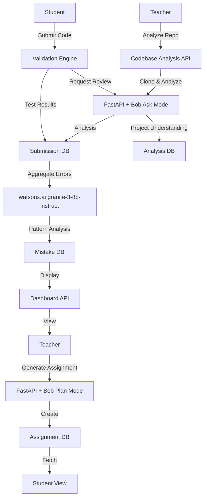

# EduBob Implementation Plan

## Phase 0: Architecture & Design Decisions
**Goal:** Define critical architectural decisions before any implementation

### Bob Integration Architecture
- **Integration Method**: Bob CLI wrapper approach
  - FastAPI spawns Bob CLI processes using `subprocess`
  - Pass prompts via stdin, capture responses from stdout
  - Use Bob's `--mode` flag to switch between plan/ask modes
  - Store Bob session exports in `bob_sessions/` directory
- **API Contract**:
  - Request: `{"mode": "plan|ask", "prompt": "...", "context": {...}}`
  - Response: `{"success": bool, "output": "...", "session_file": "..."}`
- **Timeout Handling**: 60s timeout for Bob responses, async execution with FastAPI BackgroundTasks

### Authentication & Authorization
- **MVP Approach**: Simple role-based system
  - `users` table: (id, email, password_hash, role: "teacher"|"student")
  - JWT tokens for session management
  - FastAPI dependency injection for role checking
- **Library**: `python-jose` for JWT, `passlib` for password hashing
- **CORS**: Configure FastAPI CORS middleware for `http://localhost:5173` (Vite dev server)

### Code Execution Security
- **Sandboxing Strategy**: `RestrictedPython` library for MVP
  - Whitelist safe built-ins only (no `open`, `import os`, etc.)
  - Memory limit: 50MB per execution
  - Timeout: 5 seconds per test case
  - **Future**: Docker containers for stronger isolation (Phase 5+)
- **Test Case Format**: JSON structure
  ```json
  {
    "input": {"args": [...], "kwargs": {...}},
    "expected_output": "...",
    "type": "unit|integration|edge"
  }
  ```

### Mistake Pattern Detection
- **Algorithm**: watsonx.ai integration with granite-3-8b-instruct model
  - Aggregate student errors from failed submissions
  - Send to watsonx.ai for pattern analysis
  - Extract common mistake categories and recommendations
  - Store as JSON: `{"pattern_type": "...", "description": "...", "examples": [...], "recommendation": "..."}`
- **Implementation**: Create `watsonx_client.py` for API integration
- **Fallback**: Rule-based AST parsing if watsonx.ai unavailable

### Database & Migrations
- **Migration Tool**: Alembic
- **Schema Versioning**: Track in `alembic_version` table
- **Scalability**: SQLite sufficient for MVP (< 1000 students)
  - Add indexes on foreign keys and timestamp columns
  - **Migration Path**: PostgreSQL when > 5000 students

### Error Handling & Logging
- **FastAPI Exception Handlers**: Custom handlers for validation, auth, execution errors
- **Logging**: Python `logging` module
  - File: `logs/edubob.log` (rotate daily)
  - Format: JSON structured logs for easy parsing
  - Levels: DEBUG for dev, INFO for production
- **Frontend**: Axios interceptors for API error handling

### Testing Strategy
- **Backend**: `pytest` with `pytest-asyncio`
  - Unit tests for validation engine, pattern detection
  - Integration tests for API endpoints
  - Mock Bob CLI responses for testing
- **Frontend**: `Jest` + `React Testing Library`
  - Component tests for forms, displays
  - Integration tests for API calls

### Deployment (Future)
- **Containerization**: Docker Compose
  - Backend container (FastAPI + SQLite volume)
  - Frontend container (Nginx serving React build)
- **Bob CLI**: Installed in backend container
- **Environment**: `.env` file for secrets, mounted as volume

### Bob Session Management
- **Export Trigger**: After each phase completion
- **Storage**: `bob_sessions/phase_{N}_{timestamp}.md` + screenshot
- **Automation**: Manual export via Bob UI
- **Format**: Markdown conversation + PNG screenshot
- **Documentation**: Create `bob_sessions/README.md` explaining session structure

### Deliverables
- Architecture document (this section)
- Decision log for key choices
- Bob integration proof-of-concept script
- Security checklist for code execution
- `bob_sessions/README.md` created

### Phase Completion
- **Export Bob session**: Save conversation as `.md` file and take screenshot
- **Location**: `bob_sessions/phase0_architecture.md` + `phase0_architecture.png`

---

## Phase 1: Foundation & Core Infrastructure
**Goal:** Set up project structure and basic API/database layer

### Backend
- Initialize FastAPI project with proper structure
- Set up SQLite database with core tables:
  - `users` (id, email, password_hash, role, created_at)
  - `students` (id, user_id, name) - extends users
  - `teachers` (id, user_id, name) - extends users
  - `assignments` (id, teacher_id, title, description, test_cases_json, created_at)
  - `submissions` (id, student_id, assignment_id, code, status, feedback_json, timestamp)
  - `mistakes` (id, student_id, pattern_json, count, last_seen)
- Create database connection and migration system (Alembic)
- Implement environment variable configuration (.env)
- Add .env to .gitignore
- Set up authentication (JWT tokens, password hashing)
- Configure CORS for React frontend (`http://localhost:5173`)
- Implement logging infrastructure
- Create custom exception handlers

### Frontend
- Initialize React app with Vite and functional components
- Set up routing structure (React Router)
- Create basic layout components (Header, Sidebar, MainContent)
- Configure API client (Axios) with interceptors
- Implement authentication context and protected routes
- Add login/register pages

### Testing
- Set up pytest with basic test structure
- Create mock fixtures for database and Bob CLI
- Set up Jest and React Testing Library

### Deliverables
- Working FastAPI server with health check endpoint
- Database schema created and migrations working
- Authentication system functional (login/register/JWT)
- React app running with basic navigation and auth
- Environment configuration in place
- Logging and error handling operational
- Basic test infrastructure ready

### Phase Completion
- **Export Bob session**: Save conversation as `.md` file and take screenshot
- **Location**: `bob_sessions/phase1_foundation.md` + `phase1_foundation.png`

---

## Phase 2: Assignment Generator & Validation Engine
**Goal:** Enable assignment creation and automated testing

### Backend
- **Bob Integration Module**
  - Create `bob_wrapper.py` with subprocess management
  - Implement async Bob CLI execution
  - Add session export functionality
- **Assignment Generator API** (Plan mode integration)
  - POST [`/api/assignments/generate`](backend/api/assignments.py) - Generate assignment from topic/difficulty
  - GET [`/api/assignments`](backend/api/assignments.py) - List all assignments (teacher-filtered)
  - GET [`/api/assignments/{id}`](backend/api/assignments.py) - Get assignment details
  - PUT [`/api/assignments/{id}`](backend/api/assignments.py) - Edit assignment
- **Validation Engine**
  - Create `code_executor.py` with RestrictedPython sandbox
  - POST [`/api/submissions/validate`](backend/api/submissions.py) - Run test cases against submitted code
  - Implement timeout and memory limit enforcement
  - Store validation results in database
  - Return pass/fail status with detailed feedback

### Frontend
- Assignment creation form (teacher view)
  - Topic/difficulty input
  - Bob-generated assignment preview
  - Test case editor
- Assignment list page with filters (by status, date)
- Assignment detail view showing requirements and test cases
- Loading states for Bob generation

### Testing
- Unit tests for code executor (safe/unsafe code scenarios)
- Integration tests for assignment API endpoints
- Mock Bob CLI responses for assignment generation

### Deliverables
- Teachers can generate assignments via Bob Plan mode
- Test cases are stored in JSON format and executable
- Validation engine runs Python code safely against test cases
- Bob sessions exported after assignment generation

### Phase Completion
- **Export Bob session**: Save conversation as `.md` file and take screenshot
- **Location**: `bob_sessions/phase2_assignments.md` + `phase2_assignments.png`

---

## Phase 3: Codebase Understanding & Spec-Based Review
**Goal:** Enable code submission and AI-powered review

### Backend
- **Submission API**
  - POST [`/api/submissions`](backend/api/submissions.py) - Submit student code
  - GET [`/api/submissions/{student_id}`](backend/api/submissions.py) - Get student submissions
  - GET [`/api/submissions/{id}/feedback`](backend/api/submissions.py) - Get detailed feedback
- **Codebase Analysis API** (NEW)
  - POST [`/api/codebase/analyse`](backend/api/codebase.py) - Analyze GitHub repository
    - Takes GitHub repo URL as input
    - Clones repository to temporary directory
    - Uses Bob Ask mode to generate project understanding
    - Returns structured analysis (architecture, patterns, tech stack)
    - Stores analysis in database for reference
- **Review Integration** (Ask mode)
  - POST [`/api/review/understand`](backend/api/review.py) - Analyze codebase structure
  - POST [`/api/review/spec-check`](backend/api/review.py) - Compare code against assignment spec
  - Store review feedback in submissions.feedback_json
  - Implement async review processing with status updates

### Frontend
- Code submission interface
  - Monaco Editor for code input (Python syntax highlighting)
  - File upload option for larger submissions
- **Codebase Analysis Interface** (NEW)
  - GitHub URL input form
  - Analysis progress indicator
  - Display structured project understanding
- Submission history view per student
  - Timeline of attempts
  - Status indicators (pending, passed, failed)
- Review feedback display
  - Syntax-highlighted code with inline comments
  - Test results section
  - AI review insights section
- Real-time status updates for async reviews

### Testing
- Integration tests for submission workflow
- Mock Bob Ask mode responses
- Frontend component tests for code editor
- Unit tests for GitHub cloning and analysis

### Deliverables
- Students can submit code for assignments
- Teachers can analyze GitHub repositories for project understanding
- Bob Ask mode analyzes code structure and spec compliance
- Combined feedback (tests + AI review) displayed to students
- Monaco Editor integrated with syntax highlighting
- Bob sessions exported after reviews

### Phase Completion
- **Export Bob session**: Save conversation as `.md` file and take screenshot
- **Location**: `bob_sessions/phase3_review.md` + `phase3_review.png`

---

## Phase 4: Mistake Pattern Memory & Class Dashboard
**Goal:** Track learning patterns and provide teacher insights using watsonx.ai

### Backend
- **watsonx.ai Integration**
  - Create `watsonx_client.py` for API communication
  - Configure granite-3-8b-instruct model
  - Implement error aggregation pipeline
  - POST [`/api/patterns/analyze`](backend/api/patterns.py) - Analyze aggregated errors with watsonx.ai
- **Mistake Pattern Tracker**
  - Aggregate failed submissions and error messages
  - Send to watsonx.ai for pattern analysis
  - Parse AI-generated insights into structured format
  - Update [`mistakes`](backend/models/mistakes.py) table with pattern frequency
  - GET [`/api/students/{id}/patterns`](backend/api/students.py) - Get mistake patterns per student
- **Dashboard API**
  - GET [`/api/dashboard/class-stats`](backend/api/dashboard.py) - Aggregate class performance
  - GET [`/api/dashboard/assignment-stats/{id}`](backend/api/dashboard.py) - Per-assignment statistics
  - GET [`/api/dashboard/student-progress/{id}`](backend/api/dashboard.py) - Individual progress

### Frontend
- **Student View**
  - Personal mistake pattern display (charts/graphs)
  - AI-generated recommendations for improvement
  - Progress tracking across assignments
- **Teacher Dashboard**
  - Class-wide statistics (completion rates, common mistakes)
  - watsonx.ai insights on class-level patterns
  - Per-assignment breakdown with charts
  - Individual student progress view
  - Filterable by date range, assignment, student

### Testing
- Unit tests for watsonx.ai client
- Mock watsonx.ai responses for testing
- Integration tests for dashboard APIs
- Frontend tests for chart components

### Deliverables
- watsonx.ai integration functional with granite-3-8b-instruct
- Mistake patterns automatically analyzed and displayed
- Teacher dashboard shows AI-powered class-wide insights with visualizations
- Students see their learning patterns and AI recommendations
- Complete MVP ready for testing

### Phase Completion
- **Export Bob session**: Save conversation as `.md` file and take screenshot
- **Location**: `bob_sessions/phase4_dashboard.md` + `phase4_dashboard.png`

---

## Architecture Flow



## Success Criteria
- Teachers can generate and manage assignments with Bob integration
- Teachers can analyze GitHub repositories for project understanding
- Students can submit code and receive automated feedback
- AI reviews provide meaningful insights beyond test results
- watsonx.ai analyzes mistake patterns and provides actionable insights
- Dashboard provides AI-powered class insights with visualizations
- All Bob sessions exported and stored after each phase
- System handles 100+ students without performance issues
- Code execution is secure and sandboxed
- Authentication prevents unauthorized access