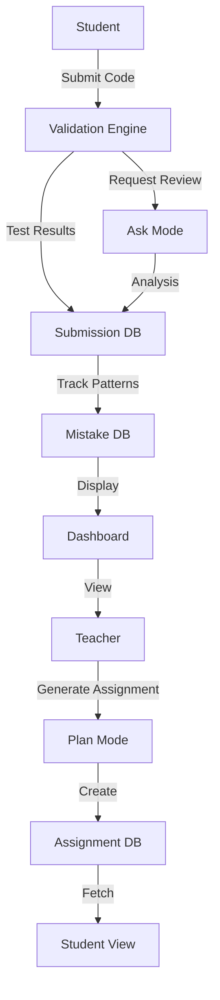

# EduBob Implementation Plan

## Phase 1: Foundation & Core Infrastructure
**Goal:** Set up project structure and basic API/database layer

### Backend
- Initialize FastAPI project with proper structure
- Set up SQLite database with core tables:
  - `students` (id, name, email)
  - `assignments` (id, title, description, test_cases)
  - `submissions` (id, student_id, assignment_id, code, status, timestamp)
  - `mistakes` (id, student_id, pattern, count, last_seen)
- Create database connection and migration system
- Implement environment variable configuration (.env)
- Add .env to .gitignore

### Frontend
- Initialize React app with functional components
- Set up routing structure
- Create basic layout components (Header, Sidebar, MainContent)
- Configure API client for backend communication

### Deliverables
- Working FastAPI server with health check endpoint
- Database schema created and migrations working
- React app running with basic navigation
- Environment configuration in place

---

## Phase 2: Assignment Generator & Validation Engine
**Goal:** Enable assignment creation and automated testing

### Backend
- **Assignment Generator API** (Plan mode integration)
  - POST [`/api/assignments/generate`](backend/api/assignments.py) - Generate assignment from topic/difficulty
  - GET [`/api/assignments`](backend/api/assignments.py) - List all assignments
  - GET [`/api/assignments/{id}`](backend/api/assignments.py) - Get assignment details
- **Validation Engine**
  - POST [`/api/submissions/validate`](backend/api/submissions.py) - Run test cases against submitted code
  - Store validation results in database
  - Return pass/fail status with detailed feedback

### Frontend
- Assignment creation form (teacher view)
- Assignment list page with filters
- Assignment detail view showing requirements and test cases

### Deliverables
- Teachers can generate assignments via Bob Plan mode
- Test cases are stored and executable
- Basic validation engine runs Python code against test cases

---

## Phase 3: Codebase Understanding & Spec-Based Review
**Goal:** Enable code submission and AI-powered review

### Backend
- **Submission API**
  - POST [`/api/submissions`](backend/api/submissions.py) - Submit student code
  - GET [`/api/submissions/{student_id}`](backend/api/submissions.py) - Get student submissions
- **Review Integration** (Ask mode)
  - POST [`/api/review/understand`](backend/api/review.py) - Analyze codebase structure
  - POST [`/api/review/spec-check`](backend/api/review.py) - Compare code against assignment spec
  - Store review feedback in submissions table

### Frontend
- Code submission interface (Monaco editor or textarea)
- Submission history view per student
- Review feedback display with syntax highlighting
- Show validation results alongside AI review

### Deliverables
- Students can submit code for assignments
- Bob Ask mode analyzes code structure and spec compliance
- Combined feedback (tests + AI review) displayed to students

---

## Phase 4: Mistake Pattern Memory & Class Dashboard
**Goal:** Track learning patterns and provide teacher insights

### Backend
- **Mistake Pattern Tracker**
  - Analyze failed submissions for common error patterns
  - Update [`mistakes`](backend/models/mistakes.py) table with pattern frequency
  - GET [`/api/students/{id}/patterns`](backend/api/students.py) - Get mistake patterns per student
- **Dashboard API**
  - GET [`/api/dashboard/class-stats`](backend/api/dashboard.py) - Aggregate class performance
  - GET [`/api/dashboard/assignment-stats/{id}`](backend/api/dashboard.py) - Per-assignment statistics

### Frontend
- **Student View**
  - Personal mistake pattern display
  - Progress tracking across assignments
- **Teacher Dashboard**
  - Class-wide statistics (completion rates, common mistakes)
  - Per-assignment breakdown
  - Individual student progress view

### Deliverables
- Mistake patterns automatically tracked and displayed
- Teacher dashboard shows class-wide insights
- Students see their learning patterns and progress
- Complete MVP ready for testing

---

## Architecture Flow

## Success Criteria
- Teachers can generate and manage assignments
- Students can submit code and receive automated feedback
- AI reviews provide meaningful insights beyond test results
- Mistake patterns help identify learning gaps
- Dashboard provides actionable class insights